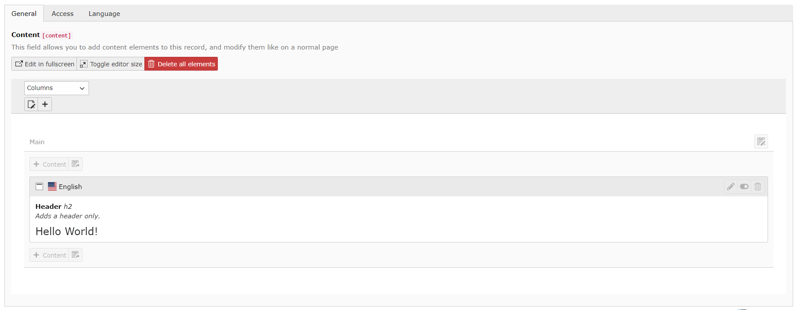

# TYPO3 - Page Layout Form Element

This package adds a new form element preset to your TYPO3 TCA configuration, which allows you to add content elements to every record. It utilizes hidden pages
to provide you a complete page layout GUI.



## Requirements

- TYPO3 v10
- TYPO3 - Better API
- Installation using Composer

## Known issues

- This extension is NOT tested with workspaces, and will probably not work correctly.
- A record that contains the content field has to be saved, before the content elements can be created.
  (This is, because otherwise I would create lots of orphan pages)

## Installation

Install this package using composer:

```
composer require labor-digital/typo3-page-layout-form-element
```

## Usage

#### Configuring the TCA

You should read up on creating TCA definitions using the Better API bundle to use this package.

After that go to your table configuration class and add a new field using the pageLayout() form preset:

```php
<?php

use LaborDigital\T3ba\ExtConfig\ExtConfigContext;
use LaborDigital\T3ba\ExtConfigHandler\Table\ConfigureTcaTableInterface;
use LaborDigital\T3ba\Tool\Tca\Builder\Type\Table\TcaTable;

class YourTable implements ConfigureTcaTableInterface
{
    /**
    * @inheritDoc
    */
    public static function configureTable(TcaTable $table, ExtConfigContext $context) : void{
         $type = $table->getType();
         $type->getField('content')->applyPreset()->pageLayout();
        
    }
}
```

#### Adding content elements

After adding the preset, make sure to clear the caches, update your SQL Database and open the record. If you created a new record, please save the record at
least once, before you go on further. You enable the content element page using the "enable elements" button. This will automatically create a "hidden" page in
the background and render the preview inside an iframe at the same spot.

#### Extending the Model

To use the content elements in your frontend you should probably start with adding a new property to your records model.

```php
<?php

namespace LaborDigital\YourExt\Domain\Model;

use LaborDigital\T3plfe\Domain\Model\PageLayout;use TYPO3\CMS\Extbase\DomainObject\AbstractEntity;

class MagazineArticle extends AbstractEntity
{
    /**
     * This field will hold the entity for the page layout
     * @var \LaborDigital\T3plfe\Domain\Model\PageLayout
     */
    protected $content;

    /**
     * Return the page layout, MIND the "?", this could be null, if no page layout is enabled
     * @return PageLayout
     */
    public function getContent(): ?PageLayout
    {
        return $this->content;
    }
}
```

#### Rendering the contents in FLUID (optional)

After you extended your model you can use the built-in viewhelper to render the content elements in fluid. For that pass the instance of your model into your
fluid view using ```$view->assign('yourModel', $model);```

And then extend your template like so:

```html
<!-- Render the content elements as HTML -->
<plfe:contentPage>{yourModel.content}</plfe:contentPage>
```

#### Using [Frontend API](https://github.com/labor-digital/typo3-frontend-api)

The page layout form element comes with built-in support for the frontend api extension. You don't have to take care of anything, just create the resource for
your model and make sure you add the "?include=content" parameter to your query when requiring the records from the API and you are all set.

To enable the integration make sure your api configuration registers the page layout resource bundle.

```php
<?php

use LaborDigital\T3ba\ExtConfig\SiteBased\SiteConfigContext;
use LaborDigital\T3fa\ExtConfigHandler\Api\ApiConfigurator;
use LaborDigital\T3fa\ExtConfigHandler\Api\BundleCollector;
use LaborDigital\T3fa\ExtConfigHandler\Api\ConfigureApiInterface;
use LaborDigital\T3fa\ExtConfigHandler\Api\Resource\ResourceCollector;
use LaborDigital\T3plfe\Api\Bundle\PageLayoutBundle;

class Api implements ConfigureApiInterface{
  public static function registerBundles(BundleCollector $collector) : void{
        // Now the api knows how to handle page layout elements
        $collector->register(PageLayoutBundle::class);
  }

  public static function registerResources(ResourceCollector $collector,SiteConfigContext $context) : void{ }
  public static function configureSite(ApiConfigurator $configurator,SiteConfigContext $context) : void{ }

}
```

#### using [~~Vue Framework~~](https://github.com/labor-digital/typo3-vue-framework)

**The vue framework is now deprecated, as a new version is developed and build on top of nuxt, this is here for legacy reasons, this documentation is valid to
v9 of this bundle**

As the official framework to our frontend API bundle, the vue-framework also has built-in support for the page layout form element. After you added the resource
of your model you can either load your record using the initial state query or via the resource api.

In your vue component you can then handle the layout like any other data. Let's say you have a content element controller like this, that defines a initial
state query for a single element:

```php
<?php
use LaborDigital\Typo3FrontendApi\ContentElement\Controller\AbstractContentElementController;
use LaborDigital\Typo3FrontendApi\ContentElement\Controller\ContentElementControllerContext;

abstract class DummyContentElement extends AbstractContentElementController
{ 
    public function handle(ContentElementControllerContext $context): void
    {
        $context->setInitialStateQuery('myModel', [
            'id'      => $context->getRequest()->getQueryParams()['id'],
            'include' => ['content'],
        ]);
    }
}
```

Now you can do the following in your vue component to render the content element list:

```vue

<template>
  <div>
    <!-- Use the content-element-children component to render your layout elements -->
    <content-element-children :children="context.initialState.get('content.children', [])"/>
  </div>
</template>

<script lang="ts">
import {ContentElementContext} from '@labor-digital/typo3-vue-framework/lib/Core/Context/ContentElementContext';

export default {
  name: 'Dummy',
  props: {
    // The context gets automatically injected
    context: null as ContentElementContext
  },
};
</script>
```

## Postcardware

You're free to use this package, but if it makes it to your production environment we highly appreciate you sending us a postcard from your hometown, mentioning
which of our package(s) you are using.

Our address is: LABOR.digital - Fischtorplatz 21 - 55116 Mainz, Germany

We publish all received postcards on our [company website](https://labor.digital). 
